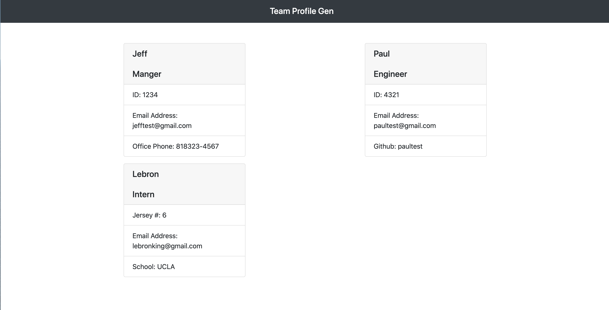

# Team-Profile-Gen-UCLA-Challenge-10

# Description
Command Line app to run using NODE that requests information of members to create an a Team Profile. Once done it generates a dynamic HTML file that 
displays the Info. Before running, the user must install npm(dependencies) & jest(testing). When the app is launched you will be prompted a series
of questions. From Name, to Role on the team, email as well  github for the Engineer & office number for Manager. Interns are prompted school attended. Once you add all your team members via command line
an HTML is generatedwith the info provided.

# Walkthrough
Walkthrough Part 1: https://watch.screencastify.com/v/JpJjOcI8mlK7vsehcvHV

Walkthrough Part 2: https://watch.screencastify.com/v/1e3t2i9S9iLLo5GreZom

